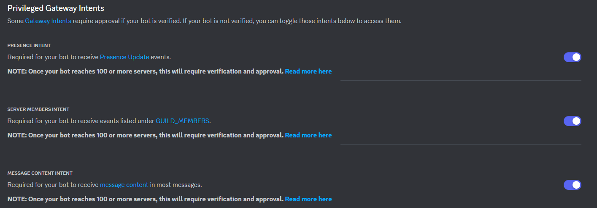

# Discord Choosable Roles
## Description
A small open-source Discord Bot written in Python which allows you to react to messages and obtain a role. This is being used in a personal Discord server of mine.

Please note this is one of my first official Python projects and I went into this without much knowledge of Python itself along with no experience with the [Discord.py](https://discordpy.readthedocs.io/en/latest/index.html) wrapper. Therefore, there's a chance a lot of this code can be improved.

The project uses SQLite to keep track of messages, reactions, reaction definitions, etc. At the moment, you may use bot commands to create/edit/delete messages along with assign/remove reactions. I understand this is probably less convenient than having everything handled in a web panel. However, I do not have any web experience with Python specifically at the moment and this project was aimed to suit the needs of my personal Discord server (although, any other guild should be able to use it without any issues and the bot itself should be able to handle multiple guilds).

In regards to performance, one - three SQL queries are performed during the following events (likely a `SELECT` query followed by an `INSERT` or `UPDATE` query).

* A reaction is added.
* A reaction is removed.
* When one of the bot commands are executed.

However, there is a cooldown implemented which should help prevent a single user from intentionally hammering resources. With that said, due to the latency when sending a Discord message, I do doubt you'd be able to hammer the resources even if a single user were to spam without the cooldown. Additionally, if a user is spamming these commands, I believe you have a bigger issue on your hands.

I did think about creating a background task to update specific lists such as the allowed roles list from each guild which is stored in SQLite (`permissions` table). However, technically, this would result in everything not being completely accurate and I don't believe the pros outweigh the cons in this case when a cooldown is being considered.

## Requirements
The Discord.py [package](https://pypi.org/project/discord.py/) is required in order to use this bot. You may install this via the following command.

```
python3 -m pip install -U discord.py
```

### Enable Intents
You must enable intents within the Discord Developers portal under your project's "Bot" tab. You should only need "Server Members Intent", but I've enabled all three just in-case.



## Command Line Usage
You may specify the settings JSON (used for the bot token, etc) and the SQLite DB location within the command line. The default settings location is `/etc/dcr/settings.json` and the default SQLite DB location is `/etc/dcr/dcr.db`.

The following are examples of how to set these in the program.

```
python3 src/main.py cfg=/home/cdeacon/settings.json sqlite=/home/cdeacon/dcr.db
```

## Config
The config file is in JSON format and the following keys are supported.

* **BotToken** - The Discord bot token. Please retrieve this from the Discord Developers page for your bot.
* **Cooldown** - The cooldown in-between adding reactions and executing bot commands for the specific user in seconds (default - **1.0** second).
* **BotMsgStayTime** - When the bot replies to a command in a text channel, delete the bot message this many seconds after (default - **10.0** seconds).

## Bot Commands
The command prefix is `!`. You must execute these commands inside of a text channel of the guild you want to modify.

### dcr_addrole
```
!dcr_addrole <role name>
```

Adds a role to the allowed roles list. If the user doesn't exist in this role, they cannot execute bot commands.

### dcr_delrole
```
!dcr_delrole <role name>
```

Removes a role from the allowed roles list.

### dcr_listroles
```
!dcr_listroles
```

Lists all of the allowed roles.

### dcr_addmsg
```
!dcr_addmsg <max reactions> <contents> <message ID>
```

Adds a message for people to react on. `Max reactions` indicates the maximum reactions a user can select at once. `Contents` indicates the message's contents (you may use the `\n` character for new lines). If the message's contents are set to "SKIP", it will not submit a new message nor edit the contents of the message. This is useful if you want to add reactions for a non-bot message. `Message ID` is optional and is only used if you want to add an existing message instead of a new one which may be easier for those that want to modify the message.

### dcr_editmsg
```
!dcr_editmsg <message ID> <max reactions> <contents>
```

Modifies a message. `Message ID` indicates the message ID you can obtain from Discord's Developer Mode. `Max reactions` indicates the new maximum reactions number (or enter "SKIP" to skip this update). `Contents` indicates the new contents for the message (or "SKIP" to skip this update).

### dcr_delmsg
```
!dcr_delmsg <message ID>
```

Removes a message by ID from the database and on the guild itself. `Message ID` indicates the message ID you can obtain from Discord's Developer Mode.

### dcr_addreaction
```
!dcr_addreaction <message ID> <reaction> <role name>
```

Adds a reaction to a message for others to start reacting to in order to obtain roles. `Message ID` indicates the message ID you can obtain from Discord's Developer Mode. `Reaction` indicates the reaction (use the reaction itself, not the text/code). `Role name` indicates the name of the role the user will receive when reacting or get removed when removing a reaction.

### dcr_delreaction
```
!dcr_delreaction <message ID> <reaction>
```

Removes a reaction from a message. `Message ID` indicates the message ID you can obtain from Discord's Developer Mode. `Reaction` indicates the reaction (use the reaction itself, not the text/code).

### dcr_clearuser
```
!dcr_clearuser <user ID>
```

Removes all rows from the `reactions` table for a certain user ID. `User ID` indicates the user's ID you can obtain from Discord's Developer Mode.

## Installing
You may use `make install` within this directory to create the `/etc/dcr/` directory and copy `settings.json.example` to `/etc/dcr/settings.json`. Please configure the `settings.json` file to your needs.

Other than that, the needed SQLite tables are created if they don't exist when the Python program is started. However, if need to be, here is the current table structure.

```SQL
CREATE TABLE IF NOT EXISTS `reactions` (id integer PRIMARY KEY AUTOINCREMENT, userid integer, msgid integer, guildid integer, reaction text)
CREATE TABLE IF NOT EXISTS `reactionroles` (id integer PRIMARY KEY AUTOINCREMENT, msgid integer, guildid integer, reaction text, roleid integer)
CREATE TABLE IF NOT EXISTS `messages` (id integer PRIMARY KEY AUTOINCREMENT, msgid integer, guildid integer, maxreactions integer, contents text)
CREATE TABLE IF NOT EXISTS `permissions` (guildid integer PRIMARY KEY, roles text)
```

## Starting
As of right now, you'll want to use `python3` against the `src/main.py` file. Something like the following should work.

```bash
python3 src/main.py
```

If there's a better way to handle this, please let me know.

## Credits
* [Christian Deacon](https://github.com/gamemann)